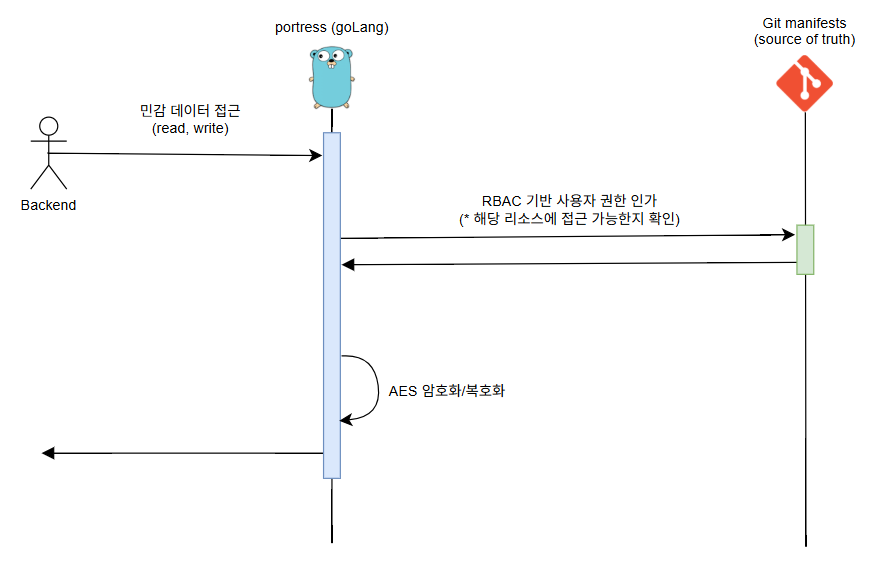
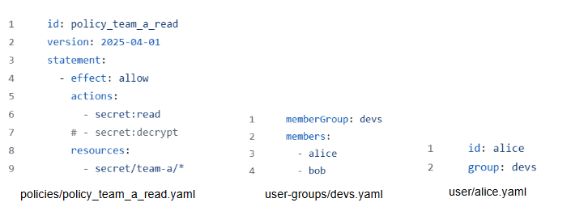

# secret-solution
외부 비밀 저장소

컨테이너 오케스트레이션 환경에서 민감한 정보를 관리하는 보안적 요소가 미비하다.

이에 표준으로 자리잡은 Kubernetes는 Secret 리소스에 AWS KMS나 HashCorp Vault를 함께 사용하길 권장하고 있다.

하지만 비용이 들거나 사용하기 어렵다는 단점이 있기 때문에 본 프로젝트에서는 이를 경량화하고 GitOps 기반 RBAC를 도입했다.

- CLI, HTTP 지원 | grpc 통신 구현중
- 현재 manifest Gitops는 public repo만 가능
- push 권한 없으면 forbidden

## Architecture



더욱 경량화된 성격에 맞게 Java Spring에서 Go 기반으로 마이그레이션 진행


## GitOps 기반 사용자 권한 관리(RBAC)



Group-Member 단위로 어떤 디렉토리에 접근할지, 접근해서 어떤 작업이 가능한지 세부적으로 manifest 관리합니다.

- [policy repo](https://github.com/downfa11/secret-policy)에서 공개하고 있지만, Private repository를 권장

본 프로젝트에서는 `sync()` 과정을 통해서 주기적 혹은 명령어를 통해 명시적으로 동기화합니다.

일부 작업에 대해서는 자동 동기화를 이용하지만, ArgoCD처럼 캐싱 레이어 도입을 검토중

## Quick Start

### test

```
go test ./...
```

- `-v`: 각 테스트 함수의 실행 결과를 상세하게 표시
- `-race`: 고루틴 간의 경쟁 조건(race condition) 탐지


### 외부 클라이언트에서 HTTP 요청

- secrets-app 실행시 각 사용자의 토큰 발행

이거 클라이언트 모듈에서 원하는 token에 기입해야 한다.

- policy-binding 작업

일단 secrets-policy 레포 가면 사용자 alice, bob, charie가 있다. 

정책 4개를 각각의 사용자나 사용자 그룹에 할당해줘야 이용 가능하다.

근데 아직 policy 레포에 bind(권한 부여)에 대한 권한을 가진 사용자나 정책을 만든게 없다. 그냥 CLI가 관리자처럼 모든 권한이 있으니 cli 들어가서 하면 편하다.

```
# alice 사용자에게 권한을 주기 위해선 devs 그룹에게 할당하면 편하다.
./go-secrets-cli policy-binding bind devs group policy_team_a_read,policy_team_a_write

# devs 그룹의 권한이 잘 바인딩되었는지 확인
./go-secrets-cli policy-binding get devs group

# policy 레포에 가보면 policy_team_a_write 정책은 오직 team-a라는 네임스페이스 아래에서만 쓰기 작업을 할 수 있다.
./go-secrets-cli secret save-raw alice team-a key hello-world!
```

이제 alice는 team-a 네임스페이스 아래의 raw 데이터({key, value})를 기록했고, 읽을 권한도 갖고 있다.

클라이언트 모듈에서 토큰값을 입력하고 웹서버를 실행해보자.

## usage

```
secret-solution cli
├─ secret
│  ├─ get [user_id] [namespace] [key]
│  ├─ get-raw [user_id] [namespace] [key]
│  ├─ get-all [user_id] [namespace]
│  ├─ save-raw [user_id] [namespace] [key] [value] --ttl
│  └─ save-encrypted [user_id] [namespace] [key] [value] --ttl
├─ git
│  ├─ sync
│  ├─ log [count]
│  ├─ rollback [commit_hash]
│  ├─ status
│  └─ checkout [branch_name]
├─ policy
│  ├─ get [policy_id]
│  └─ get-all
├─ user
│  └─ get-group [user_id]
└─ policy-binding
   ├─ bind [member_id] [member_type] [policy_ids]
   ├─ unbind [member_id] [member_type]
   ├─ unbind-all [policy_id]
   └─ get [member_id] [member_type]
```

Policy actions list:
- secret:read
- secret:decrypt
- secret:write
- secret:encrypt
- policy:read
- policy:read-list
- user:read-user-group
- policy-binding:bind
- policy-binding:unbind
- policy-binding:read-binding
